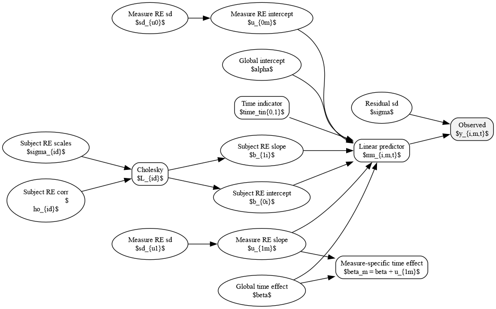
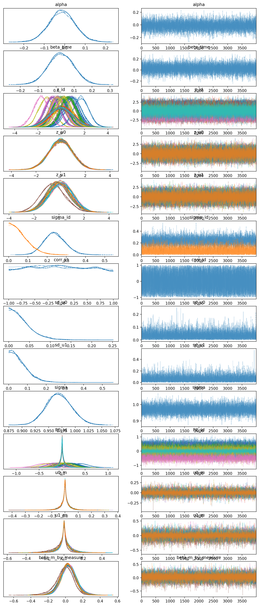
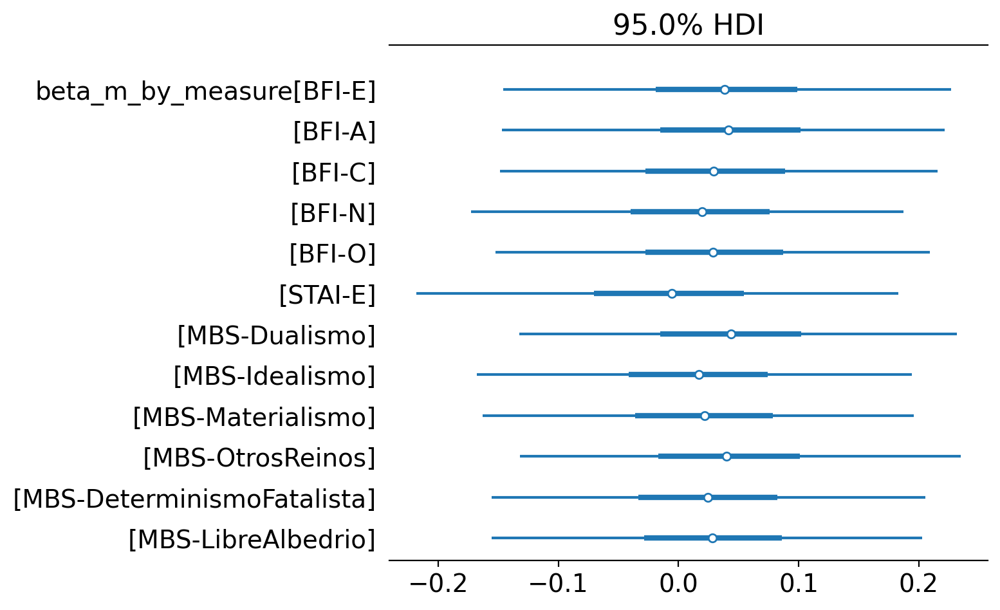

[](https://github.com/jeanvelezdata/dmt-bayesian-hierarchical/actions)
[]()
[]()

# Bayesian Hierarchical Model of Pre–Post Psychological Measures

A Bayesian re-analysis of Pallavicini et al. (2021), which examined personality, absorption, and state anxiety changes following inhaled N,N-dimethyltryptamine (DMT) in naturalistic settings. The original study relied on paired t-tests conducted independently for each psychological scale, an approach that ignores participant-level trajectories, treats outcomes as statistically independent, and does not account for the hierarchical structure of repeated-measures data.

This project replaces that approach with a unified Bayesian hierarchical model that jointly estimates pre-to-post change across all scales simultaneously. By partially pooling information across both subjects and measures, the model produces more stable effect estimates, propagates uncertainty coherently, and handles multiplicity implicitly through shrinkage rather than post-hoc correction. The result is a statistically principled re-examination of whether the reported psychological effects
persist once individual differences, shared variance across scales, and measurement noise are fully accounted for.

---

## Data Source

The dataset is publicly hosted on Zenodo:
**https://zenodo.org/records/3992359**

The repository automatically downloads the dataset at runtime and verifies its checksum to ensure reproducibility. No raw data are stored in this repository.

---

## Model Structure

Standardized outcome scores are modeled as:

```
y ~ Normal(μ, σ)

μ = α + β·time + b0_i + b1_i·time + u0_m + u1_m·time
```

| Term | Description |
|------|-------------|
| `α` | Global intercept |
| `β` | Global time effect |
| `b0_i, b1_i` | Subject random intercepts and slopes (correlated) |
| `u0_m, u1_m` | Measure random intercepts and slopes (independent) |
| `σ` | Residual noise |

Subject random effects use a correlated covariance structure via manual Cholesky decomposition. Measure effects use a non-centered parameterization. The primary estimand is:

```
β_m[measure] = β + u1_m[measure]
```

the standardized pre-to-post change for each measure, with partial pooling toward the global effect.

---
## Model Visualization

The structure of the hierarchical model is illustrated below.


---

## Repository Structure

```
configs/            Run configurations (default.yaml, fast.yaml)
src/dmt_bayes/      Core package
  ├── data_prep.py  Reshape and standardize data
  ├── model.py      Hierarchical PyMC model
  ├── fit.py        Sampler interface
  ├── summarize.py  Tables and posterior summaries
  ├── report.py     Figures and plots
  └── cli.py        Command-line interface
tests/              Smoke tests
results/            Generated outputs (git-ignored)
```

---

## Installation

Create a conda environment and install in editable mode:

```bash
conda create -n dmt_env python=3.11 -y
conda activate dmt_env
pip install -e .
```

**Dependencies:** `pymc`, `arviz`, `pandas`, `numpy`, `matplotlib`, `pyyaml`, `requests`

---

## Reproducing Results

Run the full pipeline:

```bash
dmt-bayes run --config configs/default.yaml
```

For a fast demonstration run:

```bash
dmt-bayes run --config configs/fast.yaml
```

This will:
1. Download the dataset from Zenodo and verify its checksum
2. Fit the hierarchical model via NUTS
3. Save posterior draws and summaries to `results/`

---

## Generating Tables and Plots

Re-generate outputs from saved inference data without refitting:

```bash
dmt-bayes summarize --idata results/idata.nc
dmt-bayes plot --idata results/idata.nc
```

---

## Outputs

| Path | Contents |
|------|----------|
| `results/idata.nc` | Full posterior draws (NetCDF) |
| `results/measure_labels.json` | Measure coordinate labels |
| `results/tables/posterior_summary.csv` | Posterior means and credible intervals |
| `results/tables/beta_by_measure.csv` | Per-measure time effects |
| `results/figures/trace.png` | Trace plots |
| `results/figures/beta_by_measure_forest.png` | Forest plot of measure-level effects |

---

## Interpretation

Outcomes are standardized within each measure prior to modeling, so all estimated slopes are in **standard deviation units**:

- A value of `0.5` indicates a half-SD increase from pre to post
- Uncertainty intervals are posterior 94% credible intervals
- The hierarchical structure provides shrinkage toward the global effect, robust estimation for noisy measures, and simultaneous inference across all scales

---

## Testing

A smoke test verifies the full pipeline runs end-to-end:

```bash
pytest
```

Tests run automatically on each commit via GitHub Actions.

---

## Reproducibility

- Dataset pulled from a fixed Zenodo record with checksum verification
- Config-driven sampling parameters
- Saved `.nc` inference objects allow full regeneration of all outputs without refitting

---

Example Results
---------------

Posterior diagnostics and measure-level effects can be visualized directly from the saved inference object.

Trace diagnostics example:



Measure-specific time effects:



## License

MIT
